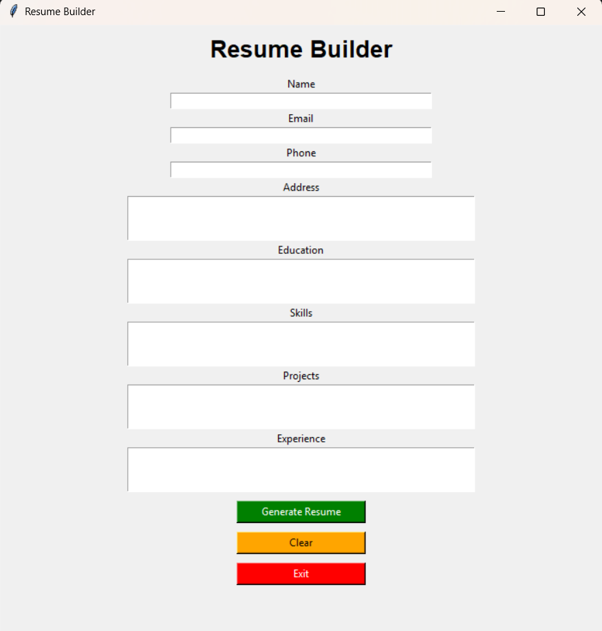
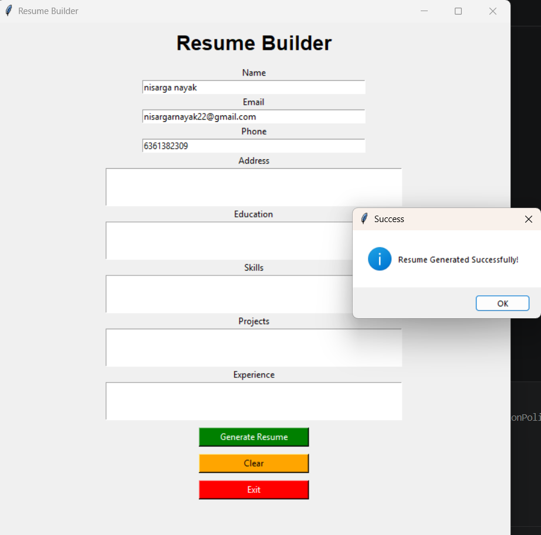

# 📝 Resume Builder

A simple and user-friendly Resume Builder web application that helps users create professional resumes easily.

---

## 🚀 Features
- Add personal information (name, email, phone)
- Add education details
- Add work experience
- Simple and clean UI
- Easy to use and beginner friendly

---

## 🛠️ Tech Stack
- HTML
- CSS
- JavaScript
- (Add backend tech here if you used Python / Flask / etc.)

---
## 📸 Screenshots

  

  

